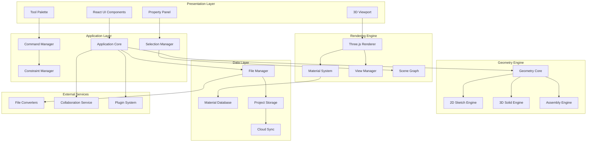
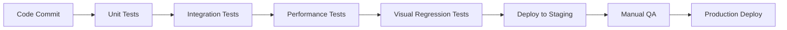

# Design Document

## Overview

The CAD Software and 3D Viewer is designed as a modern, web-based computer-aided design application built on a modular architecture. The system leverages WebGL for high-performance 3D rendering, React for the user interface, and a robust geometry engine for precise CAD operations. The architecture supports both standalone operation and cloud-based collaboration, with extensibility built into the core design.

The system is structured around five primary layers: the presentation layer (UI), the application layer (business logic), the geometry engine (CAD operations), the rendering engine (visualization), and the data layer (persistence and file I/O). This separation ensures maintainability, testability, and the ability to scale individual components as needed.

## Architecture

### System Architecture Diagram



### Technology Stack

- **Frontend Framework**: React 18 with TypeScript
- **3D Rendering**: Three.js with WebGL 2.0
- **UI Components**: Tailwind CSS with shadcn/ui
- **State Management**: Zustand for application state
- **Geometry Processing**: Custom geometry engine with OpenCASCADE.js integration
- **File Processing**: Custom parsers for STEP/IGES, existing libraries for STL/OBJ
- **Storage**: IndexedDB for local storage, cloud APIs for synchronization
- **Build System**: Vite for development and production builds
- **Testing**: Vitest for unit tests, Playwright for integration tests

## Components and Interfaces

### Core Application Components

#### Application Core
The central orchestrator that manages the overall application state and coordinates between different subsystems.

```typescript
interface ApplicationCore {
  // Project management
  createProject(name: string): Promise<Project>
  openProject(projectId: string): Promise<Project>
  saveProject(project: Project): Promise<void>
  
  // Command execution
  executeCommand(command: Command): Promise<CommandResult>
  undoCommand(): Promise<void>
  redoCommand(): Promise<void>
  
  // System lifecycle
  initialize(): Promise<void>
  shutdown(): Promise<void>
}
```

#### Geometry Engine
Handles all geometric operations, constraints, and model management.

```typescript
interface GeometryEngine {
  // 2D Operations
  createSketch(plane: Plane): Sketch
  addGeometry(sketch: Sketch, geometry: GeometryElement): void
  applyConstraint(elements: GeometryElement[], constraint: Constraint): void
  
  // 3D Operations
  extrude(sketch: Sketch, distance: number): Solid
  revolve(sketch: Sketch, axis: Axis, angle: number): Solid
  loft(profiles: Sketch[], guides?: Curve[]): Solid
  
  // Assembly Operations
  createAssembly(): Assembly
  addPart(assembly: Assembly, part: Part, transform: Transform): void
  applyMate(part1: Part, part2: Part, mate: MateConstraint): void
}
```

#### Rendering Engine
Manages 3D visualization, materials, and view operations.

```typescript
interface RenderingEngine {
  // Scene management
  createScene(): Scene
  addObject(scene: Scene, object: RenderObject): void
  removeObject(scene: Scene, objectId: string): void
  
  // View management
  setCamera(camera: Camera): void
  setViewMode(mode: ViewMode): void
  createSectionView(plane: Plane): SectionView
  
  // Material system
  createMaterial(properties: MaterialProperties): Material
  applyMaterial(object: RenderObject, material: Material): void
  
  // Rendering
  render(scene: Scene): void
  exportImage(format: ImageFormat, options: ExportOptions): Blob
}
```

#### File Management System
Handles project persistence, file I/O, and format conversion.

```typescript
interface FileManager {
  // Native format
  saveProject(project: Project, path: string): Promise<void>
  loadProject(path: string): Promise<Project>
  
  // Import/Export
  importFile(path: string, format: FileFormat): Promise<ImportResult>
  exportFile(project: Project, path: string, format: FileFormat): Promise<void>
  
  // Format conversion
  convertFile(source: string, target: string, formats: [FileFormat, FileFormat]): Promise<void>
}
```

### User Interface Components

#### Main Application Shell
```typescript
interface AppShell {
  toolbar: ToolbarComponent
  viewport: ViewportComponent
  propertyPanel: PropertyPanelComponent
  statusBar: StatusBarComponent
  menuBar: MenuBarComponent
}
```

#### Viewport Component
The primary 3D visualization area with integrated controls.

```typescript
interface ViewportComponent {
  // Rendering
  scene: THREE.Scene
  camera: THREE.Camera
  renderer: THREE.WebGLRenderer
  
  // Interaction
  controls: OrbitControls
  selectionManager: SelectionManager
  snapManager: SnapManager
  
  // Events
  onObjectSelect(callback: (object: RenderObject) => void): void
  onViewChange(callback: (view: ViewState) => void): void
}
```

#### Tool System
Extensible tool architecture for CAD operations.

```typescript
interface Tool {
  name: string
  icon: string
  cursor: CursorType
  
  activate(): void
  deactivate(): void
  onMouseDown(event: MouseEvent): void
  onMouseMove(event: MouseEvent): void
  onMouseUp(event: MouseEvent): void
  onKeyDown(event: KeyboardEvent): void
}
```

### Data Models

#### Project Structure
```typescript
interface Project {
  id: string
  name: string
  version: string
  created: Date
  modified: Date
  
  parts: Part[]
  assemblies: Assembly[]
  drawings: Drawing[]
  materials: Material[]
  
  settings: ProjectSettings
  metadata: ProjectMetadata
}
```

#### Geometry Models
```typescript
interface Part {
  id: string
  name: string
  features: Feature[]
  material?: Material
  properties: PartProperties
  transform: Transform
}

interface Feature {
  id: string
  type: FeatureType
  parameters: FeatureParameters
  sketch?: Sketch
  dependencies: string[]
}

interface Sketch {
  id: string
  plane: Plane
  elements: GeometryElement[]
  constraints: Constraint[]
}
```

#### Material System
```typescript
interface Material {
  id: string
  name: string
  category: MaterialCategory
  
  // Visual properties
  color: Color
  roughness: number
  metalness: number
  transparency: number
  
  // Physical properties
  density: number
  youngsModulus: number
  thermalConductivity: number
  
  // Custom properties
  customProperties: Record<string, any>
}
```

## Data Models

### Core Data Structures

The system uses a hierarchical data model that reflects the natural structure of CAD projects:

1. **Project** - Top-level container for all design data
2. **Part** - Individual components with geometry and properties
3. **Assembly** - Collections of parts with positioning constraints
4. **Drawing** - 2D technical documentation derived from 3D models
5. **Material** - Physical and visual property definitions

### Geometry Representation

Geometry is represented using a boundary representation (B-Rep) model:
- **Vertices** - Point locations in 3D space
- **Edges** - Curves connecting vertices
- **Faces** - Surfaces bounded by edges
- **Solids** - Closed volumes bounded by faces

### Constraint System

Constraints are stored as relationships between geometric elements:
- **Geometric Constraints** - Tangent, parallel, perpendicular, concentric
- **Dimensional Constraints** - Distance, angle, radius specifications
- **Assembly Constraints** - Mates between parts in assemblies

### File Format Strategy

The system uses a JSON-based native format with binary geometry data:
```json
{
  "version": "1.0",
  "project": {
    "metadata": {...},
    "parts": [...],
    "assemblies": [...],
    "materials": [...]
  },
  "geometry": "base64-encoded-binary-data"
}
```

## Error Handling

### Error Categories

1. **Geometry Errors** - Invalid operations, self-intersecting geometry
2. **File Errors** - Corrupt files, unsupported formats, I/O failures
3. **Constraint Errors** - Over-constrained sketches, conflicting constraints
4. **Rendering Errors** - WebGL context loss, shader compilation failures
5. **Network Errors** - Collaboration sync failures, cloud storage issues

### Error Recovery Strategy

- **Graceful Degradation** - Continue operation with reduced functionality
- **Automatic Recovery** - Attempt to fix common issues automatically
- **User Notification** - Clear error messages with suggested actions
- **State Preservation** - Maintain user work even when errors occur
- **Logging** - Comprehensive error logging for debugging

### Validation System

```typescript
interface ValidationResult {
  isValid: boolean
  errors: ValidationError[]
  warnings: ValidationWarning[]
}

interface GeometryValidator {
  validateSketch(sketch: Sketch): ValidationResult
  validateSolid(solid: Solid): ValidationResult
  validateAssembly(assembly: Assembly): ValidationResult
}
```

## Testing Strategy

### Unit Testing
- **Geometry Engine** - Test all geometric operations and constraints
- **File I/O** - Verify import/export accuracy across formats
- **Material System** - Test property assignment and persistence
- **Command System** - Verify undo/redo functionality

### Integration Testing
- **UI Components** - Test user interactions and state updates
- **Rendering Pipeline** - Verify visual output correctness
- **File Conversion** - Test round-trip accuracy between formats
- **Collaboration** - Test multi-user scenarios

### Performance Testing
- **Rendering Performance** - Maintain 60 FPS with large models
- **Memory Usage** - Monitor memory consumption with complex assemblies
- **File Loading** - Optimize load times for large CAD files
- **Constraint Solving** - Ensure responsive constraint updates

### Test Data Strategy
- **Synthetic Models** - Generated test geometry for edge cases
- **Real-world Files** - Industry-standard CAD files for compatibility testing
- **Performance Benchmarks** - Standardized models for performance comparison

### Automated Testing Pipeline


The testing strategy ensures reliability, performance, and compatibility across the entire system while maintaining development velocity through automated pipelines.